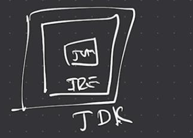

## Java overview & history JVM, JRE, JDK Java versions (8 → 21 LTS))

---

## Java Overview & History

Java is a **class-based, object-oriented programming language** that is  
designed to have **as few implementation dependencies as possible**. It is  
intended to let application developers **Write Once and Run Anywhere  
(WORA)**, meaning that compiled Java code can run on all platforms that  
support Java without the need for recompilation.

Java is known for its **simplicity, robustness, and security features**, making  
it a popular choice for **enterprise-level applications**. Java applications are  
compiled to **byte code** that can run on any **Java Virtual Machine (JVM)**. The  
syntax of Java is similar to **C/C++**.

---

## **Key Features of Java**

### **1. Platform Independent**
Compiler converts source code to **byte code** and then the **JVM** executes  
the bytecode generated by the compiler. This byte code can run on any  
platform be it **Windows, Linux, or macOS**, which means if we compile a  
program on Windows, then we can run it on Linux and vice versa.

Each operating system has a different JVM, but the output produced by all  
the OS is the same after the execution of the byte code. That is why we call  
Java a **platform-independent language**.

### **2. Object-Oriented Programming**
Java is an **object-oriented language**, promoting the use  
of objects and classes. Organizing the program in the terms of a  
collection of objects is a way of object-oriented programming, each of  
which represents an instance of the class.

The four main concepts of Object-Oriented programming are:
- **Abstraction**
- **Encapsulation**
- **Inheritance**
- **Polymorphism**

### **3. Simplicity**
Java’s syntax is **simple and easy to learn**, especially for those familiar  
with **C or C++**. It eliminates complex features like **pointers and multiple  
inheritances**, making it easier to write, debug, and maintain code.

### **4. Robustness**
Java language is **robust**, which means reliable. It is developed in such  
a way that it puts a lot of effort into **checking errors as early as possible**.  
That is why the Java compiler is able to detect even those errors that are  
not easy to detect by another programming language.

The main features of Java that make it robust are:
- **Garbage Collection**
- **Exception Handling**
- **Memory Allocation**

### **5. Security**
In Java, we don’t have **pointers**, so we cannot access **out-of-bound  
arrays**, i.e., it shows **ArrayIndexOutOfBound Exception** if we try to do so.  
That’s why several security flaws like **stack corruption or buffer overflow**  
are impossible to exploit in Java.

Also, Java programs run in an **environment that is independent of the OS**  
(which makes Java programs more secure).

### **6. Distributed**
We can create **distributed applications** using the Java programming  
language. **Remote Method Invocation (RMI)** and **Enterprise Java Beans  
(EJB)** are used for creating distributed applications in Java.

Java programs can be easily distributed on one or more systems that are  
connected to each other through an **internet connection**.

### **7. Multithreading**
Java supports **multithreading**, enabling the concurrent execution of  
multiple parts of a program. This feature is particularly useful for  
applications that require **high performance**, such as games and  
real-time simulations.

### **8. Portability**
As we know, Java code written on one machine can be run on another  
machine. The **platform-independent bytecode** of Java makes it portable.

**WORA (Write Once Run Anywhere)** makes Java applications generate  
a `.class` file that contains **binary-format code**, independent of  
machine architecture. It is a primary reason Java is used in the  
**enterprise IT industry worldwide**.

### **9. High Performance**
Java architecture is designed to reduce runtime overhead. Java uses a  
**Just-In-Time (JIT) compiler**, which compiles code on a **demand basis**,  
compiling only those methods that are called, helping applications execute  
faster.

---

## **Essential Java Terminologies You Need to Know**

### **1. Java Virtual Machine (JVM)**
The **Java Virtual Machine (JVM)** is an integral part of the Java platform,  
responsible for executing Java bytecode. It ensures that the output of  
Java programs is consistent across different platforms.

- Writing a program is done by a Java programmer.
- Compilation is done by the **JAVAC compiler**, included in the **JDK**.
- JVM executes the bytecode generated by the compiler.

Each operating system has its own JVM, but all JVMs follow the same rules  
and standards. This is why Java is called a **platform-independent language**.

### **2. Bytecode**
**Bytecode** is the intermediate representation of Java code, generated by  
the Java compiler. It is platform-independent and executed by the **JVM**.

### **3. Java Development Kit (JDK)**
The **JDK** is a complete Java development kit that includes:
- Compiler
- Java Runtime Environment (JRE)
- Java Debuggers
- Java Docs

It is required to **create, compile, and run** Java programs.

### **4. Java Runtime Environment (JRE)**
The **JDK includes JRE**. JRE allows Java programs to **run**, but it does not  
allow compilation.

JRE includes:
- Browser
- JVM
- Applet support
- Plugins

### **5. Garbage Collector**
In Java, programmers can’t delete objects manually. The **Garbage  
Collector** reclaims memory of objects that are no longer referenced.

Memory of actively referenced objects **cannot be recovered**.

### **6. ClassPath**
The **Classpath** defines the location where the Java runtime and compiler  
look for `.class` files. External libraries must be added to the classpath.

Everything in Java is represented as a **class**, including the `main`  
function.

---

## **Advantages of Java**
- **Platform Independent**
- **Object-Oriented**
- **Secure**
- **Large developer community**
- **Enterprise-level applications**

---

## **Disadvantages of Java**

### **1. Performance**
Java can be slower compared to **C++** due to its **virtual machine** and  
automatic memory management.

### **2. Memory Management**
Automatic memory management can increase **memory usage** and  
runtime overhead.

---

## JVM, JR, JDK | Java Execution Process (Explained with Diagram)


### **1. Writing Code**
- Java code is written in a `.java` file (e.g., `_1_Hello.java`)
- Contains the **main() method**, which is the entry point.

### **2. Compiling Code**
```bash
javac _1_Hello.java
```
• This converts the code into **Bytecode (.class file)** which is  
**platform-independent**.

### **3. Bytecode**
- The compiled **.class file** contains instructions in **Bytecode format**.
- This **bytecode is not directly executed by the operating system**.

### **4. JRE (Java Runtime Environment)**
- The **JRE contains**:
    - **JVM (Java Virtual Machine)** — executes bytecode.
    - **Libraries (lib)** — support runtime functionalities.

### **5. JVM**
- The **JVM reads the .class bytecode** and **interprets or JIT-compiles** it  
  into **native code**.
- The **native code** is then executed on the underlying **Operating System  
  (like Windows)**, which runs on **hardware (HW)**.

### **6. Output**
- The output **"Hello, World!"** is printed to the console via  
  **System.out.println**



--- 
## Java versions (8 → 21 LTS)

### **Java 8 (2014) – LTS (Long Term Support)** 
- Introduced **Lambda Expressions**
- **Streams API** for functional-style operations
- **Functional Interfaces**
- **Optional** class to avoid NullPointerException
- New **Date & Time API (java.time)**
- Default and static methods in interfaces

---

### **Java 9 (2017)**
- **Java Platform Module System (JPMS / Project Jigsaw)**
- **JShell** (interactive REPL)
- Improved **Stream API**
- Private methods in interfaces
- Enhanced **JVM performance**

---

### **Java 10 (2018)**
- **Local Variable Type Inference (`var`)**
- Improved **Garbage Collection performance**
- Application Class-Data Sharing

---

### **Java 11 (2018) – LTS**
- **HTTP Client API** (standardized)
- **`var` in lambda parameters**
- New **String methods** (`isBlank()`, `lines()`, `strip()`)
- Files utility enhancements
- Removal of Java EE modules

---

### **Java 12 (2019)**
- **Switch Expressions (preview)**
- Improved Garbage Collection

---

### **Java 13 (2019)**
- **Text Blocks (preview)** for multi-line strings
- Enhanced **Switch Expressions**

---

### **Java 14 (2020)**
- **Switch Expressions (standardized)**
- **Records (preview)** – immutable data carriers
- Helpful **NullPointerException** messages

---

### **Java 15 (2020)**
- **Text Blocks (standardized)**
- Sealed Classes (preview)
- Pattern matching improvements

---

### **Java 16 (2021)**
- **Records (standardized)**
- **Pattern Matching for `instanceof`**
- Strong encapsulation of JDK internals

---

### **Java 17 (2021) – LTS**
- **Sealed Classes (standardized)**
- Enhanced **Pattern Matching**
- Foreign Function & Memory API (incubator)
- Long-term enterprise support release

---

### **Java 18 (2022)**
- UTF-8 as default charset
- Simple Web Server
- Performance improvements

---

### **Java 19 (2022)**
- **Virtual Threads (preview – Project Loom)**
- Structured Concurrency (incubator)

---

### **Java 20 (2023)**
- Further improvements to **Virtual Threads**
- Performance and scalability enhancements

---

### **Java 21 (2023) – LTS**
- **Virtual Threads (standardized)**
- **Pattern Matching for Switch**
- **Record Patterns**
- Sequenced Collections
- Foreign Function & Memory API (standardized)
- Best choice for **modern backend & cloud-native apps**

---

### **LTS Versions Summary**
- **Java 8** – Legacy enterprise standard
- **Java 11** – Stable upgrade path
- **Java 17** – Modern enterprise baseline
- **Java 21** – Latest LTS, recommended for new projects

