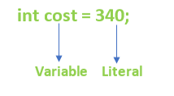

## Java Literals

---

In Java, **literals** are the **constant values** that appear directly in a program.  
They can be **assigned directly to a variable**. <br>



Java supports **different kinds of literals** based on data types.

---

## Types of Literals in Java

There are **four major types of literals** in Java:

1. **Integer Literal**
2. **Character Literal**
3. **Boolean Literal**
4. **String Literal**

---

## 1. Integer Literal

An **integer literal** represents **whole numbers** without fractional parts.

### Types of Integer Literals
- **Decimal (Base 10)** → digits 0–9
- **Binary (Base 2)** → prefix `0b` or `0B`
- **Octal (Base 8)** → prefix `0`
- **Hexadecimal (Base 16)** → prefix `0x` or `0X`

### Example
```java
int a = 10;      // decimal
int b = 0b1010;  // binary
int c = 012;     // octal
int d = 0xA;     // hexadecimal
```

---

## 2. Character Literal

A **character literal** represents a **single character** enclosed in  
**single quotes (' ')**.

Java uses **Unicode** to represent characters.

### Example
```java
char ch1 = 'A';
char ch2 = '7';
char ch3 = '@';
```

### Special Character Literals (Escape Sequences)
```java
char newline = '\n';
char tab = '\t';
char backslash = '\\';
char singleQuote = '\'';
```

---

## 3. Boolean Literal

A **boolean literal** represents a logical value.

### Allowed Values
- `true`
- `false`

### Example
```java
boolean isJavaFun = true;
boolean isRaining = false;
```

> Java does **not allow** numeric values like `0` or `1` for boolean literals.

---

## 4. String Literal

A **string literal** represents a **sequence of characters** enclosed in  
**double quotes (" ")**.

Strings in Java are **objects**, not primitive data types.

### Example
```java
String name = "Java";
String message = "Welcome to Java Programming";
```

---

## Key Points to Remember
- Literals represent **fixed values** in a program
- Integer literals can be written in **decimal, binary, octal, or hexadecimal**
- Character literals use **single quotes**
- String literals use **double quotes**
- Boolean literals support only **true** and **false**

---
