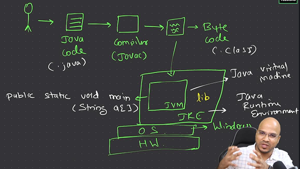

## JVM, JR, JDK | Java Execution Process (Explained with Diagram)

---


### **1. Writing Code**
- Java code is written in a `.java` file (e.g., `_1_Hello.java`)
- Contains the **main() method**, which is the entry point.

### **2. Compiling Code**
```bash
javac _1_Hello.java
```
• This converts the code into **Bytecode (.class file)** which is  
**platform-independent**.

### **3. Bytecode**
- The compiled **.class file** contains instructions in **Bytecode format**.
- This **bytecode is not directly executed by the operating system**.

### **4. JRE (Java Runtime Environment)**
- The **JRE contains**:
    - **JVM (Java Virtual Machine)** — executes bytecode.
    - **Libraries (lib)** — support runtime functionalities.

### **5. JVM**
- The **JVM reads the .class bytecode** and **interprets or JIT-compiles** it  
  into **native code**.
- The **native code** is then executed on the underlying **Operating System  
  (like Windows)**, which runs on **hardware (HW)**.

### **6. Output**
- The output **"Hello, World!"** is printed to the console via  
  **System.out.println**


