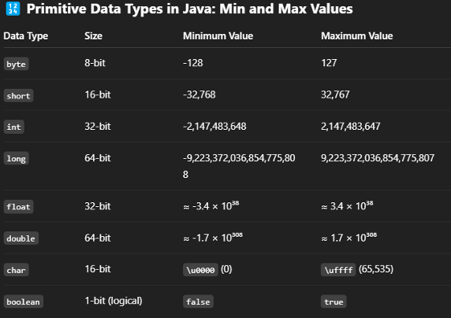

## Data Types in Java (Primitive & non-primitive data types)

---
Data types in Java are of different sizes and values that can be stored in
a variable that is made as per convenience and circumstances to cover
up all test cases.

Java is statically typed and also a strongly typed language because
each type of data (such as integer, character, hexadecimal, packed
decimal, and so forth) is predefined as part of the programming
language and all constants or variables defined for a given program must
be declared with the specific data types. 

### **Why Data Types Matter in Java?**
Data types matter in Java because of the following reasons, which are listed below:

- **Memory Efficiency**: Choosing the right type (**byte vs int**) saves memory.
- **Performance**: Proper types reduce runtime errors.
- **Code Clarity**: Explicit typing makes code more readable.

---
## **Java Data Type Categories**
Java has **two categories** in which data types are segregated:

### **Primitive Data Type**
These are the **basic building blocks** that store **simple values directly in memory**.  
Examples of primitive data types are:
- **boolean**
- **char**
- **byte**
- **short**
- **int**
- **long**
- **float**
- **double**

---

### **Non-Primitive Data Types (Object Types)**
These are **reference types** that store **memory addresses of objects**.  
Examples of non-primitive data types are:
- **String**
- **Array**
- **Class**
- **Interface**
- **Object**

---

## **Primitive Data Types*

### **1. boolean Data Type**
The `boolean` data type represents a **logical value** that can be either  
**true** or **false**.

Conceptually, it represents a **single bit of information**, but the actual size  
used by the virtual machine is **implementation-dependent** and typically at  
least one byte (eight bits) in practice.

Values of the boolean type are **not implicitly or explicitly converted** to any  
other type using casts.

**Syntax:**
```java
boolean booleanVar;
```

## 2. byte Data Type

The byte data type is an 8-bit signed two’s complement integer.  
The byte data type is useful for saving memory in large arrays.

Syntax:
```java
byte byteVar;
```

---

## 3. short Data Type

The short data type is a 16-bit signed two’s complement integer.  
Similar to byte, a short is used when memory savings matter, especially  
in large arrays where space is constrained.

Syntax:
```java
short shortVar;
```

---

## 4. int Data Type

The int data type is a 32-bit signed two’s complement integer.

Syntax:
```java
int intVar;
```

---

## 5. long Data Type

The long data type is a 64-bit signed two’s complement integer.  
It is used when an int is not large enough to hold a value, offering a  
much broader range.

Syntax:
```java
long longVar;
```

---

## 6. float Data Type

The float data type is a single-precision 32-bit IEEE 754 floating-point  
data type.

Use float (instead of double) if you need to save memory in large arrays  
of floating-point numbers.

Size: 4 bytes (32 bits)

Syntax:
```java
float floatVar;
```

---

## 7. double Data Type

The double data type is a double-precision 64-bit IEEE 754 floating-point  
data type.

For decimal values, this data type is generally the default choice.

Size: 8 bytes (64 bits)

Syntax:
```java
double doubleVar;
```

---

## 8. char Data Type

The char data type is a single 16-bit Unicode character.

Size: 2 bytes (16 bits)

Syntax:
```java
char charVar;
```

---

## Why is the Size of char 2 Bytes in Java?

Unlike languages such as C or C++ that use the ASCII character set,  
Java uses the Unicode character set to support internationalization.

Unicode requires more than 8 bits to represent characters from different  
languages including:

- Latin
- Greek
- Cyrillic
- Chinese
- Arabic
- and many more

As a result, Java uses 2 bytes to store a char, ensuring it can represent  
any Unicode character.

---

## Non-Primitive (Reference) Data Types

### 1. Strings

Strings are defined as an array of characters.

The difference between a character array and a string in Java is that:

- A string is designed to hold a sequence of characters in a single variable
- A character array is a collection of separate char-type entities

Unlike C/C++, Java strings are not terminated with a null character.

A Java library example is Comparator Interface.  
If a class implements this interface, then it can be used to sort a collection.

---

### 5. Array

An Array is a group of like-typed variables that are referred to by a  
common name.

Arrays in Java work differently than they do in C/C++.

Important points about Java arrays:

- In Java, all arrays are dynamically allocated
- Since arrays are objects in Java, we can find their length using the member `length`
- This is different from C/C++, where length is determined using `size`
- A Java array variable can be declared using [] after the data type
- The variables in the array are ordered and each has an index beginning with 0
- Java arrays can be used as:
    - Static field
    - Local variable
    - Method parameter
- The size of an array must be specified using an int, not long or short
- The direct superclass of an array type is Object
- Every array type implements:
    - Cloneable
    - java.io.Serializable

---

## Key Points to Remember

- Strong Typing: Java enforces strict type checking at compile-time, reducing runtime errors
- Memory Efficiency: Choosing the correct data type improves memory usage
- Immutability of Strings: Strings cannot be changed once created, ensuring safety in multithreaded environments
- Array Length: The length of arrays in Java is fixed once declared and can be accessed using the length attribute

---

## Primitive & Non-Primitive Data Types

- Primitive data types store actual values directly
- Non-primitive data types store references to objects

